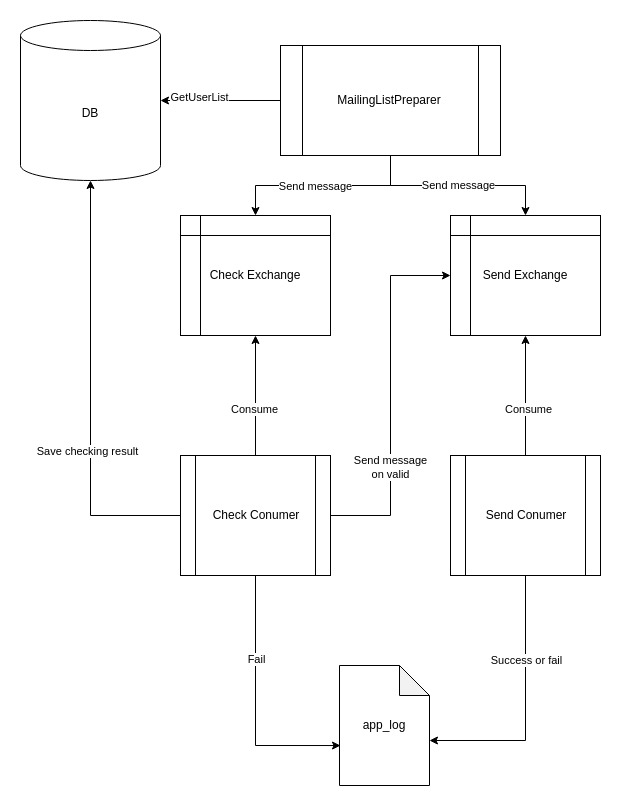

# Тестовое задание karma8: сервис для рассылки уведомлений об истекающих подписках

## Техническое задание

[Ссылка](./artifacts/TZ.pdf)

## Инструкция для запуска
Запустить команду  
```bash
docker-compose build && docker-compose up -d
```

Далее для запуска демо можно вызвать скрипт (перед запуском демо-скрипта лучше подождать 30 секунд, т.к. создается база с 1млн записей)
```bash
./demo.sh
```

Для проверки работы можно посмотреть логи работы ```./var/log/app.log```  
Также можно посмотреть на работу консьюмеров в web-интерфейсе RabbitMQ `http://localhost:15673/` (данные для входа `test_user` : `test_pass`) 

P.S. Cron настроен(увидеть можно внутри [Dockerfile](./docker/php/Dockerfile))

## Тех. решение

1. [работа с БД](./database/database.sql) 
   1. В рамках реальной продуктовой задачи я бы настоял на рассмотрении вынесения информации о подписке в отдельную таблицу, т.к. это полноценная сущность и может повлиять на масштабируемость системы.  
   Но в рамках текущей задачи посчитал избыточным такое изменение структуры
   2. Добавлено поле `INT primary-key` - чтобы уменьшить накладные расходы на updat'ы
   3. Добавлен уникальный индекс на `email`
   4. Изменен тип поля `validts`, чтобы было меньше костылей по преобразованию в коде + сделал его Nullable. Я бы изменил его название на `expired_at`, но решил оставить старое для преемственности.
   5. Добавил индекс по полю `validts`, но с ограничением `WHERE validts IS NOT NULL`, т.к. имеется большое количество NULL значений
   6. Удалил поле `checked`, так как достаточно сделать поле `valid` nullable
   7. Изменил типы полей `confirmed` и `valid` на boolean, т.к. этого достаточно для хранения целевой информации
   8. Тестовые данные генерируются в самом SQL-скрипте
2. Алгоритм
   1. Подготовить загрузчик конфигурации и необходимых функций [bootstrap.php](bootstrap.php)
   2. [Подготовить скрипт](./src/MailingListPreparer.php) (`php /src/MailingListPreparer.php -d`), который будет принимать на вход параметр с количеством дней, по которым нужно сделать выборку
   3. Внутри скрипта получить всех пользователей, которые должны быть оповещены, кроме тех, кто точно не может быть оповещен
   4. Чтобы сэкономить деньги компании, вызов `check_email` должен осуществляться только по тем пользователям, которым реально требуется оповещение и нет никакой информации о том, валиден их email или нет
   5. Если пользователь подтвердил свой email или у него ранее проверенный валидный email, то публикуем в exchange для отправки сообщения
   6. Если у пользователя не подтвержденный email, то публикуем событие в exchange для проверки email
   7. Чтобы избежать зависания консьюмеров, они имеют ограниченное время жизни и количество сообщений, которые они могут обработать.
   8. Консьюмеры для упрощения запусаются через Cron, но рассчитаны на запуск через супервизор в нужном количестве


   Схема приложения:  
    